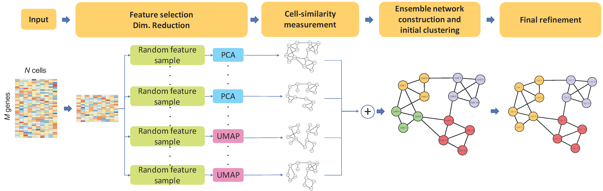

---
title: "scCLUE-vignette"
output: html_document
---


## Background
Recent advances in single-cell RNA sequencing technologies have provided a breakthrough to understand and decipher complex biological mechanism underlying different cell by providing a novel means to profile gene expression in individual cells. The essential first step to analyze single cell RNA sequencing study is the accurate cell type identification. 

In this work, we propose a novel single cell clusteringalgorithm, called **scCLUE**(**s**ingle **c**ell **CLU**stering through **E**nsemble feature selection and similarity measurements). The proposed single cell clustering algorithm can omit the optimal (or quality) feature selection process that requires high computational complexity by adopting the ensemble feature selection and similarity measurements.

{ width=100% }


## Installation guide 
To install scCLUE (R package), you need to install devtools and type the following command:
```
install.packages("devtools")
library(devtools)
install_github("jeonglab/scCLUE")
```


## Example
In this example, we will test scCLIE using the single cell RNA seq. data from Buettner et al. (2015). To begin with, lets load the test data using the following command:

```
library(scCLUE)
data(scdata)
```

Then, there are two variables 'scdata' and 'label'


To remove artificial biase, we perform the library size normalization using a cpm and take a log-transformation. Note that we will use edgeR to obtain the normalized data.If you need to install edgeR, please use the following command: :

```
if (!requireNamespace("BiocManager", quietly = TRUE))
    install.packages("BiocManager")

BiocManager::install("edgeR")

library(edgeR)
log_scdata <- log10(1+edgeR::cpm(scdata))
```


Finally, we can run the single clustering algorithm using the default parameters. Note that nCls is the number of true cell types in the single cell RNA sequencing data. 
```
final_cls <- scCLUE(log_scdata = log_scdata, nCls = length(table(label)))
```

Now, you can find the predicted single cell clustering labels at **final_cls$membership**

```
> final_cls$membership
  [1] 1 1 1 1 1 1 1 1 1 1 2 1 1 1 3 3 1 1 2 1 1 1 1 1 1 1 1 1 1 1 3 1 1 1 3 1 1 1 3 1 1 1 2 1 1 3 2 1 3
 [50] 1 1 3 1 1 1 1 1 1 1 2 2 2 2 2 2 2 2 2 2 2 2 2 2 2 2 2 2 2 2 2 2 2 2 2 2 2 2 2 2 2 2 2 2 2 2 2 2 2
 [99] 2 2 2 2 2 2 2 2 2 2 2 2 2 2 2 2 2 3 2 3 3 3 2 3 3 3 3 1 3 3 3 3 3 3 3 3 1 3 3 3 3 2 3 3 3 3 3 3 3
[148] 3 3 3 3 3 3 3 3 3 3 3 3 3 3 3 3 3 3 3 3 3 3 3 3 3 3 3 3 3 3 3 3 3 3 2
```


